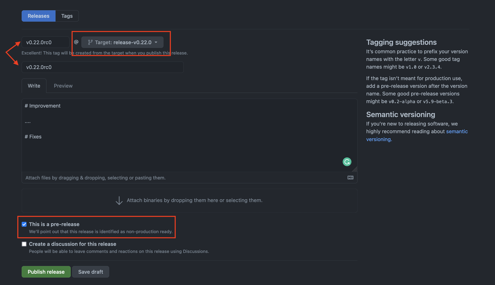
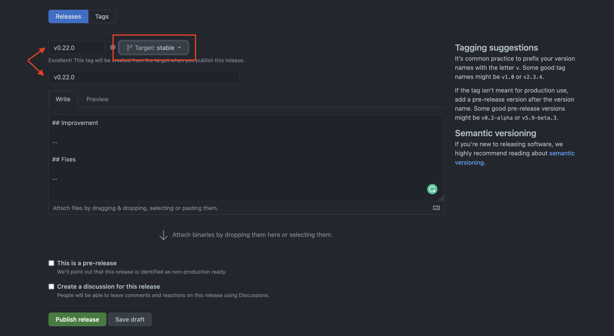

# Releases

This guide is to describe how to make relases and pre-releases for the [Meilisearch repository](https://github.com/meilisearch/meilisearch).

In the core team, a sprint lasts 4 weeks.

At the begining of the last week, the pre-release week starts: during this week, one or several pre-releases (RC e.g. Release Candidate) are released.
This allows:
- the integration team to update the integrations accordingly
- the docs team to finalize the documentation
- the users to test the new version in advance
- the core team to get feedback and bug reports before the official release

## 🛥️ Meilisearch release process

### How to create the first pre-release (RC)

In the Meilisearch repository:

1. Make sure you are on the `main` branch and pull the last commits:

```bash
git checkout main
git pull origin main
```

2. Create a release branch named `release-vX.X.X` where `X.X.X` is the new version and push this branch

```bash
git checkout -b release-vX.X.X
git push -u origin release-vX.X.X
```

3. Go the the GitHub interface, in the [`Release` section](https://github.com/meilisearch/meilisearch/releases).

4. Click on the `Draft a new release` button

5. Fill the form with:
- the title of the release: `vX.X.Xrc0`
- the tag associated to the release: should be `vX.X.Xrc0`
- ⚠️ the branch on which to push the tag: `release-vX.X.X`. Do not push the tag to `main`!
- the description: add as many details as possible: the PRs, the authors, the new usage, the external contributors we want to thank...
- ⚠️ the `This is a pre-release` check box



6. Finally, when you are sure, click on the `Publish release` button.

The CIs will be triggered to:
- upload binaries to the GitHub RC.
- publish the associated Docker image (`vX.X.X`) to DockerHub.

### What if some bugs are in the RC?

1. Create a new branch starting from the branch `release-vX.X.X` and commit on this new branch.

2. Open and merge the PR originating this new branch and pointing to `release-vX.X.X`

### How to release the next RCs

When all/enough hotfixes have been done to the `release-vX.X.X` branch, create a new RC.
The steps are the same as for `How to create the first pre-release (RC)` but starting from the step 3 and with the new RC name.

## Meilisearch official release

### How to do the official release

1. Merge the `release-vX.X.X` into the `stable` branch:
```bash
git checkout release-vX.X.X
git pull origin release-vX.X.X
git checkout stable
git pull origin stable
git merge release-vX.X.X
git push origin stable
```

2. Go the the GitHub interface, in the [`Release` section](https://github.com/meilisearch/meilisearch/releases).

3. Click on the `Draft a new release` button

4. Fill the form with:
- the title of the release: `vX.X.X`
- the tag associated to the release: should be `vX.X.X`
- ⚠️ the branch on which to push the tag: `stable`. Do not push the tag to `main`!
- the description. Add as many details as possible: the PRs, the authors, new usage examples, the external contributors we want to thank...



5. Finally, when you are sure, click on the `Publish release` button.

The CIs will be triggered to:
- upload binaries to the GitHub release.
- publish the Docker images (`latest` and `vX.X.X`) to DockerHub.
- publish binaries for Homebrew and APT

### After the release

Some commits might miss to `main` since the core-team did some hotfixes merged to the `release-vX.X.X` branch.
You need to bring them back from `stable` to `main` by merging a PR originating `stable` and pointing to `main`.

### How to do patched release (following hotfixes)

It happens some releases come with impactful bugs in production (e.g. indexation or search issues): we obviously don't wait for the next cycle to fix them and we release a patched version of Meilisearch.

1. Create a new release branch starting from `stable`

```bash
git checkout stable; git pull origin stable
git checkout -b release-vX.X.X
git push -u origin release-vX.X.X
```

2. Open and merge the PR originating `release-vX.X.X` and pointing to `release-vX.X.X`. Don't forget to change the version name in `Cargo.toml` files!

3. Follow all the steps in the ["How to do the official release" section](#how-to-do-the-official-release) with the patched version name.

4. Same as the official release, bring the new commits back from `stable` to `main` by merging a PR originating `stable` and pointing to `main`.

## 🎈 Other library release process

The release process of other repositories maintained by the core team is described in the corresponding CONTRIBUTING.md of each repository.
